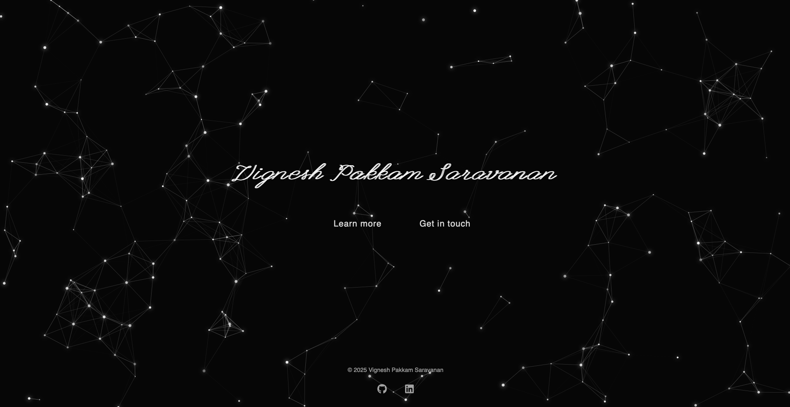
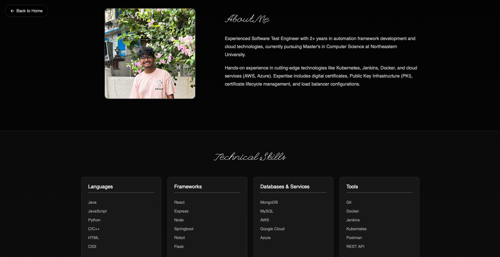
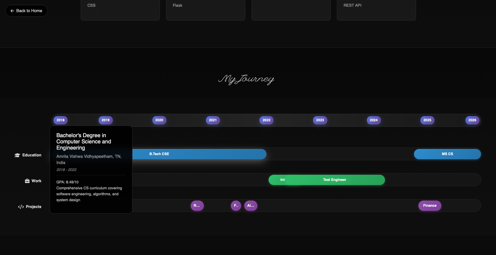
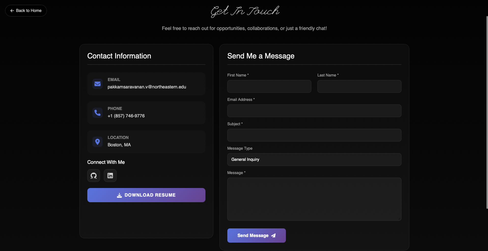

# web_portfolio# Portfolio Website

A modern, interactive portfolio website featuring an animated starfield background, responsive design, and comprehensive professional showcase.

## Author

**Vignesh Pakkam Saravanan**  
MS Computer Science Student  
Northeastern University, Boston, MA  
Email: pakkamsaravanan.v@gmail.com  
[GitHub](https://github.com/Vignesh-23)  
[Linked In](https://www.linkedin.com/in/vignesh-p-s-3b59b91ba/)

## Class Link

This project is part of the Web Development course at Northeastern University.  
Course: CS 5610 - Web Development  
Term: Fall 2025  
Class [Link](https://johnguerra.co/classes/webDevelopment_online_fall_2025/)

## Design Document and links
[Design Document](<Design Document for CS5610 - Project1.pdf>)


[Slides](https://docs.google.com/presentation/d/1_KQj5MdUk7oq7pclntTEuXLqArELV8Ra00MpnGwwbaY/edit?slide=id.p#slide=id.p)

[Video](https://drive.google.com/file/d/1NRNhNvQRgVN6LVG_cg9y9kvQ24PewsPi/view?usp=sharing)

[Live Page](https://vignesh-23.github.io/web-portfolio/)

## Project Objective

The objective of this project is to create a professional portfolio website that:

1. **Showcases Professional Experience** - Presents 2+ years of software engineering experience in an engaging, interactive format
2. **Demonstrates Technical Skills** - Highlights proficiency in modern web technologies through both content and implementation
3. **Facilitates Networking** - Provides multiple contact channels for recruiters, collaborators, and peers
4. **Exhibits Design Competency** - Implements responsive design, animations, and user experience best practices
5. **Serves as a Digital Resume** - Acts as a comprehensive online presence for career advancement

The website specifically targets tech recruiters, hiring managers, academic collaborators, and fellow students, providing each audience with relevant information in an accessible format.

## Screenshot

### Desktop View

*Homepage featuring animated starfield constellation effect*

### About Me 

*About me page with consistent css*


### Interactive Timeline

*Hover-enabled timeline showing education, work, and projects*

### Contact Me



## Technologies Used

- **HTML5**
- **CSS3**
- **JavaScript**
- **Bootstrap 5.3.0**
- **Font Awesome 6.0.0**
- **Google Fonts**

## Project Structure

```
web_portfolio/
│
├── index.html                 # Landing page with starfield animation
├── package.json              # Project metadata and dependencies
│
├── pages/
│   ├── about.html           # About page with timeline & skills
│   └── contact.html         # Contact form and information
│
├── css/
│   └── styles.css          # Main stylesheet with animations
│
├── js/
│   └── script.js           # Interactive features and animations
│
├── assets/
│   └── files/ 
│      └── (resume.pdf)        # Downloadable resume
│   └── images/
│
└── README.md               # Project documentation
```

## Features

### Core Features
- Animated starfield background with constellation effects
- Fully responsive design for all devices
- Interactive timeline visualization for career journey
- Organized skills showcase by category
- Professional contact form with validation
- Downloadable resume functionality

### Technical Highlights
- Smooth CSS transitions and animations
- JavaScript particle system for starfield
- Hover-activated timeline details
- Mobile-optimized touch interactions
- Performance-optimized animations
- Accessibility-compliant design

## Instructions to Build

### Prerequisites

- Modern web browser (Chrome, Firefox, Safari, Edge)
- Text editor or IDE (VS Code recommended)
- Basic knowledge of HTML, CSS, and JavaScript
- Git for version control

### Installation

1. **Clone the repository**
   ```bash
   git clone https://github.com/Vignesh-23/web_portfolio.git
   cd web_portfolio
   ```

2. **Open in your preferred editor**
   ```bash
   code .  # For VS Code
   ```

3. **Launch the website**
   
   **Option A: Direct file opening**
   - Navigate to the project folder
   - Right-click `index.html` to open in browser
   
   **Option B: Using Reload Server**
   ```bash
   # npm -g install reload
   reload -p 8080
   ```
   Then navigate to `http://localhost:8000` in the browser


## Contributing

While this is a personal portfolio project, suggestions and feedback are welcome:

1. Fork the repository
2. Create a feature branch (`git checkout -b feature/improvement`)
3. Commit changes (`git commit -am 'Add improvement'`)
4. Push to branch (`git push origin feature/improvement`)
5. Open a Pull Request

## License

This project is licensed under the MIT License - see the [LICENSE](LICENSE) file for details.

## Use of AI
- Claude Opus was used to make the star constellation in the landing page.
- Prompt: Design a landing page, in index.html
My name should be in italics and the links to the aboutMe and ContactMe pages should be below it. For the background should be like a star constellation which is moving.
Only give the index.html, styles.css and script.js for this part alone.

## Acknowledgments

- Northeastern University for web development curriculum
- Bootstrap team for the responsive framework
- Font Awesome for icon library
- Google Fonts for typography
- Inspiration from modern portfolio design trends

## Contact
- **Email**: pakkamsaravanan.v@northeastern.edu
- **LinkedIn**: [Vignesh P S](https://www.linkedin.com/in/vignesh-p-s-3b59b91ba/)
- **GitHub**: [@Vignesh-23](https://github.com/Vignesh-23)
- **Phone**: +1 (857) 746-9776

---

*Last Updated: September 2025*  
*Version: 1.0.0*
